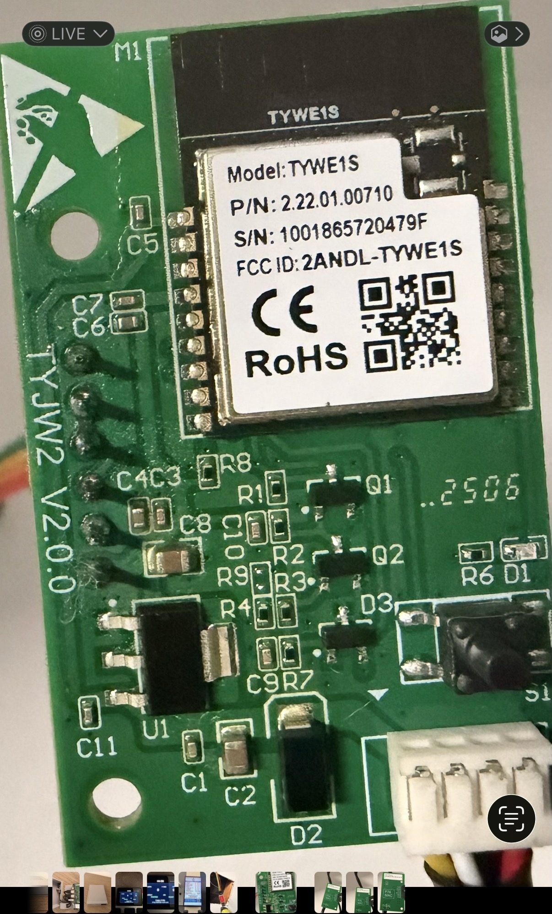
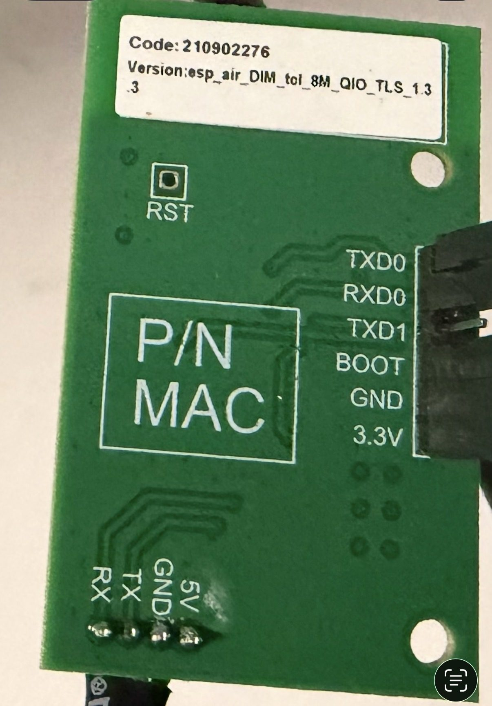

# Pioneer WYT ESPHome Component


## Tested Units

- **Vtronix Classic America** 12000 BTU Smart Mini Split AC/Heat Pump, 19 SEER2
- **Pioneer WYT012GLSI20RL** with TYWE1S adapter board P/N `2.22.01.00710`, sticker version `esp_air_DIM_tcl_8M_QIO_TLS_1.3`




This fork is currently tuned for the tested **Pioneer WYT012GLSI20RL** remote/manual feature set instead of exposing every feature seen in other TCL/Tuya profiles.

## What It Does

- Full climate control (mode, temp, fan)
- Eco, Turbo, Mute, Sleep modes
- Fan speeds from the manual cycle: Auto, Mute, Low, Low-Mid, Medium, Mid-High, High, and Turbo
- Display toggle
- Up-down and left-right louver motor toggles
- 46°F freeze protection / 8°C heater
- Sensors: indoor and outdoor temperature

## Installation

### Option 1: Copy the component

Copy `esphome/components/pioneer_minisplit/` to your ESPHome config folder.

### Option 2: Use as external component

```yaml
external_components:
  - source:
      type: git
      url: https://github.com/rog713/pioneer-wyt-esphome
      ref: main
    components: [pioneer_minisplit]
```

## Configuration

Two example configs are included:

**`example-production.yaml`** - Minimal setup for daily use. Just the sensors you actually want on a dashboard. Start here.

**`example-debug.yaml`** - Everything. Raw bytes, packet history, debug sensors. Use this if you're investigating the protocol or something isn't working right. Creates 50+ entities.

Both examples use the same component code. Production keeps the entity list small, while debug exposes raw packet and byte sensors so protocol changes can be verified before being used daily.

Both require a `secrets.yaml` with your WiFi credentials and API keys. See `secrets.yaml.example`.

## Climate Entity

Creates a climate entity with:
- **Modes:** Off, Cool, Heat, Dry, Fan Only, Auto
- **Fan:** Auto, Low, Medium, High, plus Mute, Low-Mid, Mid-High, and Turbo as custom modes
- **Switches:** Eco, Turbo, Mute, Sleep, Display, Freeze Protection, Up-Down Louver, Left-Right Louver

## TYWE1S TLS 1.3 Notes

The `esp_air_DIM_tcl_8M_QIO_TLS_1.3` board variant reports 68-byte status packets. Older component versions used a 64-byte RX buffer and dropped these packets.

Verified on `WYT012GLSI20RL`:

| Feature | TX | RX |
|---------|----|----|
| Auto fan | `0x38` | `0x08` |
| Low fan | `0x3A` | `0x09` |
| Medium fan | `0x3B` | `0x0A` |
| High fan | `0x3D` | `0x0B` |
| Low-Mid fan | `0x3E` | `0x0C` |
| Mid-High fan | `0x3F` | `0x0D` |
| Turbo | `0x3D` + turbo flag | `0x0B` + turbo flag |
| Mute | `0x3A` + mute flag | `0x09` + mute flag |

The production config follows the Pioneer manual naming. Debug mode can still expose lower-level protocol details while features are being mapped.

The original firmware contains additional sleep strings, but the WYT012GLSI20RL remote exposes Sleep as a simple on/off feature. Production uses a `Sleep` switch.

The manual exposes louver motor toggles, not fixed louver positions. Production therefore exposes up-down and left-right louver switches; debug mode keeps raw bytes available for deeper louver mapping.

## Switches

| Switch | What it does |
|--------|--------------|
| Display | Unit display on/off |
| Eco | Energy saver mode for cooling/heating |
| Turbo | Highest fan speed / rapid temperature change |
| Mute | Quiet low-fan operation |
| Sleep | Sleep mode on/off |
| Freeze Protection | 46°F / 8°C minimum heat mode |
| Up-Down Louver | Vertical louver motor on/off |
| Left-Right Louver | Horizontal louver motor on/off |

## Protocol Docs

See [docs/PROTOCOL.md](docs/PROTOCOL.md) for the byte-level details if you want to understand or extend this.

## Credits

- [mikesmitty/esphome-components](https://github.com/mikesmitty/esphome-components/tree/main/components/pioneer) - Pioneer Diamante component, outdoor unit status logic
- [bb12489/wyt-dongle](https://github.com/bb12489/wyt-dongle) - BB protocol documentation
- [squidpickles/tuya-serial](https://github.com/squidpickles/tuya-serial) - Protocol research
